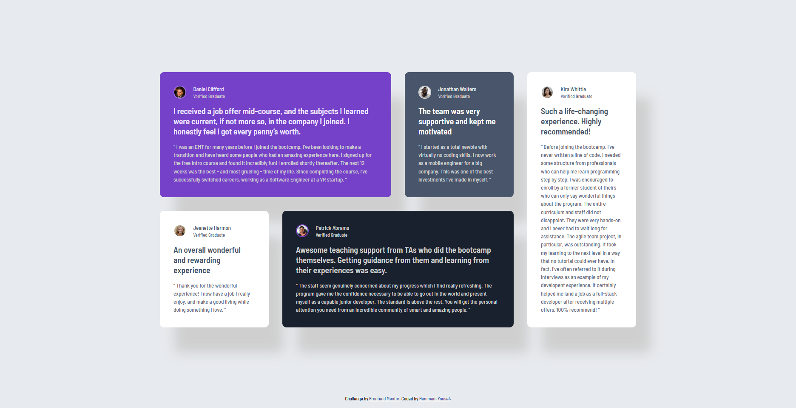

# Frontend Mentor - Testimonials grid section solution

This is a solution to the [Testimonials grid section challenge on Frontend Mentor](https://www.frontendmentor.io/challenges/testimonials-grid-section-Nnw6J7Un7). Frontend Mentor challenges help you improve your coding skills by building realistic projects. 

## Table of contents

- [Overview](#overview)
  - [The challenge](#the-challenge)
  - [Screenshot](#screenshot)
  - [Links](#links)
- [My process](#my-process)
  - [Built with](#built-with)
  - [What I learned](#what-i-learned)
  - [Continued development](#continued-development)
- [Author](#author)

## Overview

### The challenge

Users should be able to:

- View the optimal layout for the site depending on their device's screen size

### Screenshot



### Links

- Solution URL: [Add solution URL here](https://your-solution-url.com)
- Live Site URL: https://hammamyousef.github.io/Testimonials-grid-section/

## My process

### Built with

- Semantic HTML5 markup
- CSS custom properties
- Flexbox
- CSS Grid
- Mobile-first workflow

### What I learned

- How to use CSS Grid and Flexbox together for responsive layouts.
- The use of CSS custom properties for consistent theming.
- How to structure semantic HTML for accessibility and maintainability.

#### Example: CSS Grid for responsive layout

```css
.testimonial-card__container {
  display: grid;
  grid-template-columns: 1fr;
  gap: 2rem;
  max-width: 70rem;
}
@media screen and (min-width: 1180px) {
  .testimonial-card__container {
    grid-template-columns: repeat(4, 1fr);
    grid-template-rows: repeat(2, 1fr);
  }
}
```

### Continued development

- Explore using CSS variables for more theme options.
- Add animations or transitions for card appearance.

## Author

- Frontend Mentor - [@HammamYousef]https://www.frontendmentor.io/profile/HammamYousef
